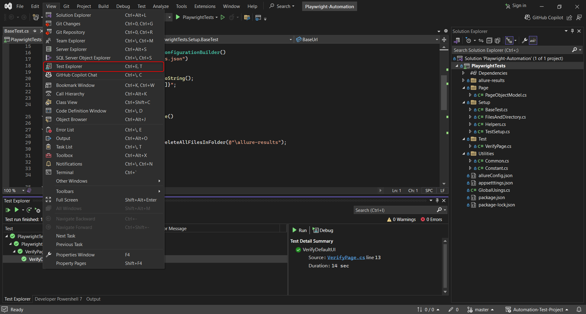
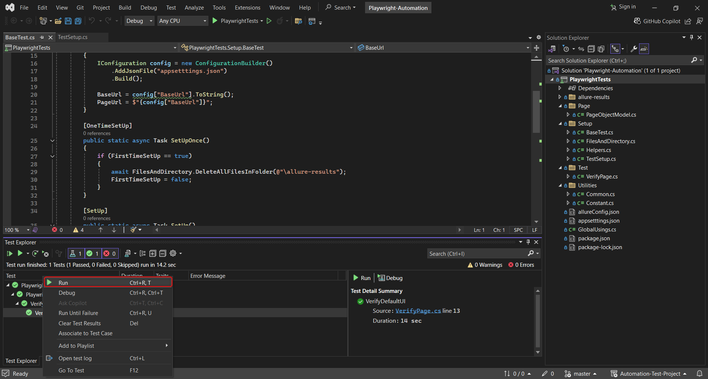
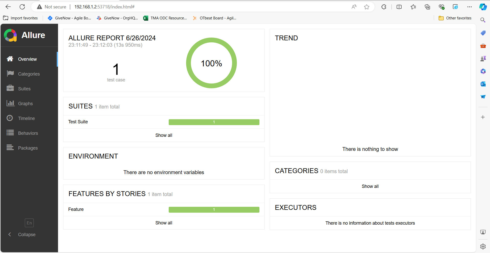

# Documentation
### Introduction
This is my frist time that I have investigated and used **MarkDown**. If have any problem with this documentation please ignore.

### Menu of Documentation
<ol>
  <li>Installation</li>
  <li>How to run test case</li>
  <li>How to run report</li>
  <li>Referrence Document</li>
</ol>

# Installation
### Step to Install

After download my project successfully, please run this command: 

```
pwsh bin/Debug/net8.0/playwright.ps1 install
```

If pwsh is not available, you have to install PowerShell.
And then

- Open your PowerShell
- Cd `bin/Debug/net8.0` 
  
 `(Ex: C:\Users\ltrieuvi\OneDrive\Desktop\Automation-Test-Project\PlaywrightTests\bin\Debug\net8.0)`

After that, run this command
```
pwsh playwright.ps1 install
```

# How to run test case
After install, you need click on **Build Solution**

And then, open your test explorer `(View -> Test Explorer)`

- 

Then you can choose to click run all your test cases or just one test cases

- 

# How to run report
Please **make sure** your computer that have **installed NodeJS and Java**.

If not, you need to install and setup environment for them.

Then, open terminal in the project and **cd** to **PlaywrightTests** 

- `Ex: C:\Users\ltrieuvi\OneDrive\Desktop\Automation-Test-Project\PlaywrightTests\PlaywrightTests`

After that, run this command to open the report

```
npx allure-commandline serve
```



# Referrence Document
Install playwright - https://playwright.dev/dotnet/docs/intro