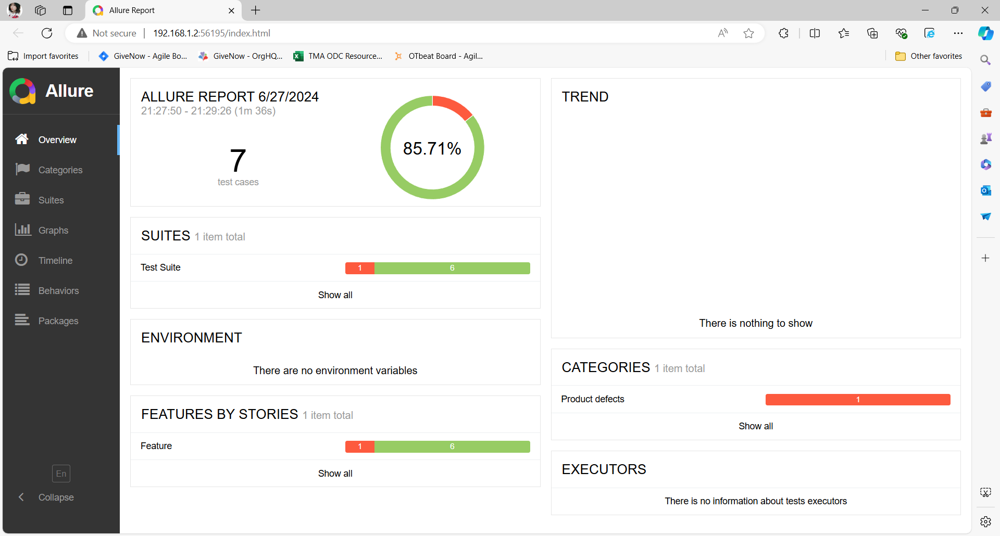
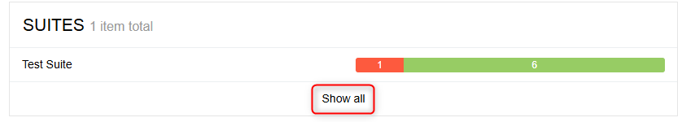
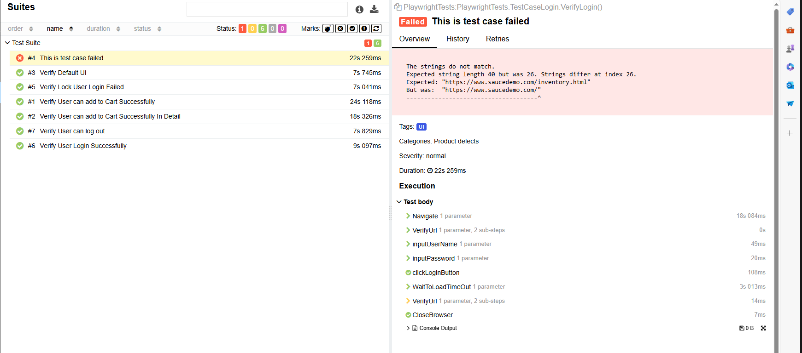

# Documentation
### Introduction
This is my frist time that I have investigated and used **MarkDown**. If have any problem with this documentation please contact to me.

### Menu of Documentation
<ol>
  <li>Installation</li>
  <li>How to run test case</li>
  <li>How to run report</li>
  <li>Interpret the test results</li>
  <li>Referrence Document</li>
</ol>

# Installation
### Step to Install

After download my project successfully, please run this command: 

```
pwsh bin/Debug/net8.0/playwright.ps1 install
```

If pwsh is not available, you have to install PowerShell.
And then

- Open your PowerShell
- Cd `bin/Debug/net8.0` 
  
 `(Ex: C:\Users\ltrieuvi\OneDrive\Desktop\Automation-Test-Project\PlaywrightTests\bin\Debug\net8.0)`

After that, run this command
```
pwsh playwright.ps1 install
```

# How to run test case
After install, you need click on **Build Solution**

And then, open your test explorer `(View -> Test Explorer)`

- 

Then you can choose to click run all your test cases or just one test cases

- 

# How to run report
Please **make sure** your computer that have **installed NodeJS and Java**.

If not, you need to install and setup environment for them.

Then, open terminal in the project and **cd** to **PlaywrightTests** 

- `Ex: C:\Users\ltrieuvi\OneDrive\Desktop\Automation-Test-Project\PlaywrightTests\PlaywrightTests`

After that, run this command to open the report

```
npx allure-commandline serve
```


# Interpret the test results
### As requirement of the test exam:
> The tests should include positive andnegative scenarios

So I create 2 test suits with **Login** page and **Home** page

- **Login** has 4 passed and 1 failed test cases
- **Home** has 2 passed test cases


---
### So let's go ahead with report.

The report will show that how many test cases **passed**, **failed** and show the percent.



Click **Show all** to go to the detail of report so that you can go over your test cases



In the details page, you can see how many time that need to run for a test case

The report will show  the step that was marked and the reason why that step failed


# Referrence Document
Install playwright - https://playwright.dev/dotnet/docs/intro